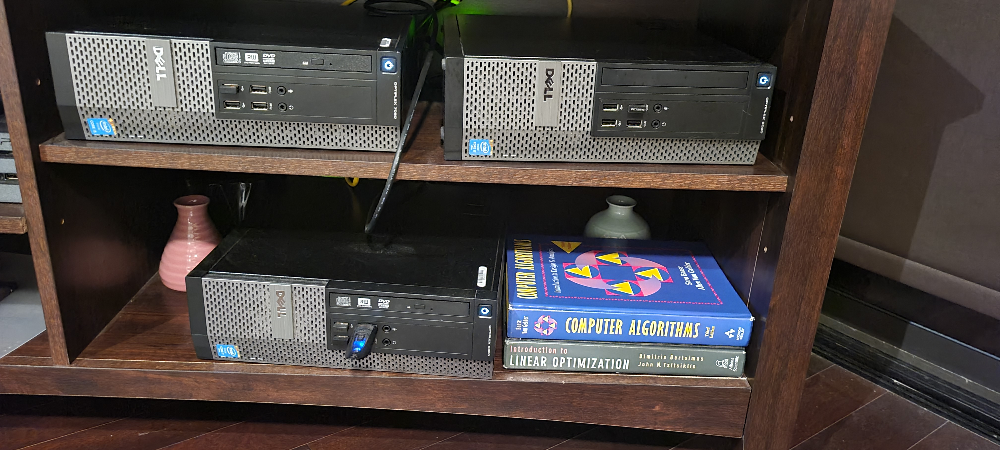

# My data science and programming practices 

This is Matt Najarian and I have been working on data science and optimization for 7 years. Currently I am a lead data scientists working on IoT projects. 
I have gathered some notebooks, codes, and notes that I share here; as a reference for myself, and mybe as some guides for visitors.

Instead of reinventing the wheel, I will refer you to useful links that you may find useful. There are two websites that have useful cheat sheets for data scientist:  
1- https://www.mit.edu/~amidi/teaching/  
2- https://stanford.edu/~shervine/teaching/

# My personal cluster:
One of my hobbies is working with my cluster. I have 3 PCs that I have installed several applications and platforms:
- Apache SuperSet (visit [lohrasp.com](http://lohrasp.com/))
- Hadoop
- Spark 3
- The current demo application (visit [projects.lohrasp.com](http://projects.lohrasp.com/login/))
- PostgreSQL 14.0 and PgAdmin 4

## Spark
As I learned spark, I decided to share what I learned both for my own reference future readers.
<li>Spark installation
<li>RDD
<li>DataFrame
<li>MLIB
 

![Read more] (/spark_practice/README.md)

## TensorFlow/Keras

## Stock Screeners Should Have
It is a gathering of some useful tips and sites I found on the internet. 

## FastApi codes

useful sites 
https://levelup.gitconnected.com/building-a-website-starter-with-fastapi-92d077092864
https://github.com/hackingthemarkets/stockscreener
https://jinja.palletsprojects.com/en/2.9.x/templates/#int
