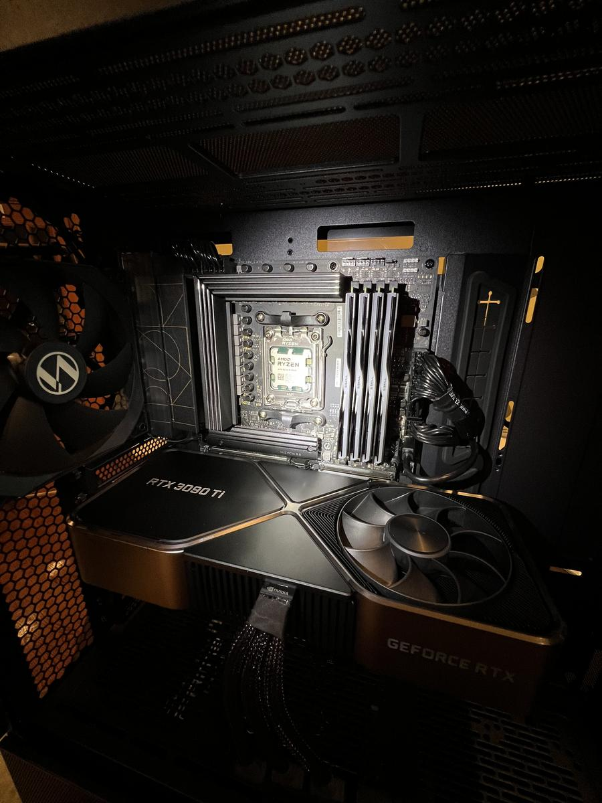

# My data science and programming practices - as of March 2025 

Hello, I'm Matt Najarian. With over seven years of experience in data science and optimization, I currently serve as a lead data scientist. My work spans a variety of projects in areas such as machine learning, deep learning, and optimization. This repository is a collection of my notebooks, code, and notes—curated both as a personal reference and as a potential guide for visitors.

Instead of reinventing the wheel, I will provide you with links to valuable resources. Here are two websites offering comprehensive cheat sheets for data scientists:
1. https://www.mit.edu/~amidi/teaching/  
2. https://stanford.edu/~shervine/teaching/

# My Personal Cluster

One of my hobbies is managing my personal computing cluster. It consists of three standard PCs and one high-end PC, on which I have installed several applications to support my projects and experiments.

I built my high-end PC using parts sourced from MicroCenter and a used Nvidia RTX 3090 Ti Founders Edition (24 GB) that I purchased for $800. The system is powered by a Ryzen 7 CPU and equipped with 32 GB of RAM (F5-6000J3238F16G).

In this repo, I share some of my experiences in the following ares:
- [optimization](./optimization/README.md) which contains my optimization model implementations  in Python, Java, and C++.
- machine learning
    - [applications to marketing](https://github.com/lohraspco/data-science-old/blob/master/marketing/README.md)
        - customer segmentation
- LLM, RAG, Chatbot (powering by Deepseek running on Ollama)
- [Apache Spark / Databricks](./apache_spark/README.md)
    - recommendation system (ALS, )
- SQL (PostgreSQL 14.0 and PgAdmin 4)
- NoSQL (Neo4j) 
- Business Intelligence

 and platforms:
- Apache SuperSet
- Hadoop
- Spark 3
- The current demo application (will be live soon visit [projects.lohrasp.com](http://projects.lohrasp.com/))
- PostgreSQL 14.0 and PgAdmin 4
- Apache Airflow

# Apache Spark / Databricks
As I learned spark, I decided to share what I learned both for my own reference future readers.
<li>Spark installation
<li>RDD
<li>DataFrame
<li>MLIB
 

<a href="https://github.com/lohraspco/data-science-old/blob/master/apache_spark/README.md/">Read more</a>

# TensorFlow/Keras
During my Ph.D. studies, with two of my friends we tutored TensorFlow. Check the following links for more information:
- https://github.com/easy-tensorflow/easy-tensorflow

 

# Python Tips and Projects

In in the <a href="https://github.com/lohraspco/data-science/tree/master/python_codes/">python_codes</a> subdirectory, I have included some of my personal and educational projects. Here is a list of items you will find: 

- <a href="https://github.com/lohraspco/data-science/blob/master/python_codes/python_cheat_sheet.ipynb"> Python cheat sheet</a>: I have noted down some tips and tricks while working on different projects which can be useful to you. 

- <a href="https://github.com/lohraspco/data-science/tree/master/python_codes/unit_commitment" style="bold">Security Constrained Unit Commitment</a>: Unit Commitment is the process of turning on (committing) resources to meet load and other market requirements. • Security-Constrained Unit Commitment (SCUC) commits units (electricity generators). while respecting limitations of the transmission system and unit. I have coded it in <a href="https://github.com/lohraspco/data-science/tree/master/Java_and_CPP/unit_commitment_Java">Java</a> and <a href="https://github.com/lohraspco/data-science/tree/master/python_codes/unit_commitment">Python</a>. 

- <a href="https://github.com/lohraspco/data-science/tree/master/python_codes/investment">Maximizing Infrastructure Resiliency Under Budgetary Constraint</a>: it is crucial for investment on resiliency to distribute budget among different resources, in a way that the effect is maximized. Check my paper in the following link:
https://www.sciencedirect.com/science/article/abs/pii/S0951832019308336

- <a href="https://github.com/lohraspco/data-science/tree/master/python_codes/component_importance">Component Importance</a>: at the time of recovery from a disaster, some components play a more important. This is an ongoing research of mine to find those components. The codes include cool visualization (<a href="https://cytoscape.org/">Cytoscape</a>) and random graph generation codes.  

 

# SQL Tips and Tricks
There are some SQL cheatsheet and tips that I added to [SQL](https://github.com/lohraspco/data-science/tree/master/SQL) folder

## FastApi codes
Visit the simple site the I have created using FastApi at http://projects.lohrasp.com/.

 

# Useful Links
Here is a list of useful links that Steve Nouri has shared on his [Twitter](https://www.linkedin.com/in/stevenouri?miniProfileUrn=urn%3Ali%3Afs_miniProfile%3AACoAAAj_qcABebPCFHyk-0_-nNFZsxiGnzK5i6c&lipi=urn%3Ali%3Apage%3Ad_flagship3_feed%3BqMLBp%2FEXQ1e2hvalwm580g%3D%3D&licu=urn%3Ali%3Acontrol%3Ad_flagship3_feed-actor_container&lici=YuWZTkjVPY88%2B%2BlL9xXKFg%3D%3D) account. While I put them here for simplicity of acces, please also read on the Twitter. 

1. [All algorithms implemented in Python, by: The Algorithms](https://github.com/TheAlgorithms/Python)

2. [DataScienceResources, by: jb](https://github.com/jonathan-bower/DataScienceResources)

3. [Playground and Cheatsheet for Learning Python, by: Oleksii Trekhleb](https://github.com/trekhleb/learn-python)

4. [Learn Python 3, by: Jerry Pussinen](https://github.com/jerry-git/learn-python3)

5. [Awesome Data Science, by: Fatih Aktürk, Hüseyin Mert & Osman Ungur, Recep Erol](https://github.com/academic/awesome-datascience)

6. [data-scientist-roadmap, by: MrMimic](https://github.com/MrMimic/data-scientist-roadmap)

7. [Data Science Best Resources, by: Tirthajyoti Sarkar](https://github.com/tirthajyoti/Data-science-best-resources/blob/master/README.md)

8. [Ds-cheatsheets, by: Favio André Vázquez](https://github.com/FavioVazquez/ds-cheatsheets)

9. [Jupyter, Numpy, Pandas, SKlearn, Keras, and MatplotLib cheatsheets ](https://github.com/lemoz/Cheatsheets)

10. [SQL](https://www.stratascratch.com/blog/sql-interview-questions-you-must-prepare-the-ultimate-guide/)