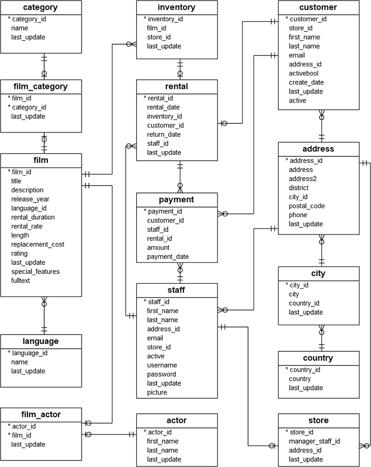

In this section there are three sub-sections:
- [SQL Interview](https://github.com/lohraspco/data-science/blob/master/SQL/sql_codes.ipynb) 
- [NoSQL (Neo4j)](https://github.com/lohraspco/data-science-old/blob/master/SQL/no_sql.md)
Most of the SQL examples are mainly applied on the DVD rental database. This database is an example database for PostgreSQL.

# DVD rental database

The DVD rental database represents the business processes of a DVD rental store. The DVD rental database has many objects, including:

15 tables
1 trigger
7 views
8 functions
1 domain
13 sequences

DVD Rental ER Model

 The Entity Relationship (ER) model for DVD Rental shows includes tables, fields, and relationships.

