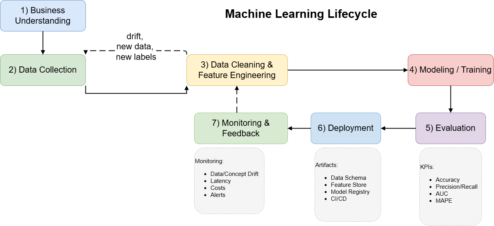

# Python codes

The Machine Learning (ML) lifecycle is a set of steps that guide the development and deployment of machine learning models. It includes the following phases:

 
&nbsp;&nbsp;&nbsp;&nbsp;&nbsp;&nbsp;&nbsp

Machine Learning encompasses 
- supervised methods such as 
    - classification (StratifiedKFold)
    - regression 
- unsupervised methods such as clustering, 
- and reinforcement learning for sequential decision-making.

# Data Drift (a.k.a. Covariate Shift) (P(Y∣X) remains the same)
When the distribution of input features (X) changes over time, but the relationship between features and the target (i.e., P(Y∣X)) remains the same.

Example: A fraud detection model trained on transactions from 2022 starts getting 2024 data with different user behavior (new countries, payment methods).
- Symptoms: Input features have changed. Model may perform worse even if the labels haven't changed.
- Detection: Compare feature distributions (e.g., using KS test, PSI, or visualization). Monitor input feature stats (mean, std, etc.).

# Model Drift (a.k.a. Concept Drift) (P(Y∣X) changes)
When the relationship between input and output (i.e., P(Y∣X)) changes — the model’s understanding becomes outdated.

Example: In loan approval, previously a high debt-to-income ratio meant default. But economic changes make that less predictive, so model decisions become less accurate.

- Symptoms: Same input now leads to different outcomes. Drop in model accuracy or prediction quality.
- Detection: Monitor model performance metrics (accuracy, AUC, F1, etc.). Use labeled data or human review to spot drift.