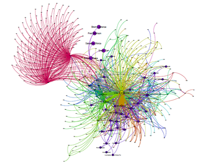

# Python codes

I have developed codes in Python which include:
- Security Constrained Unit Commitment (unit_commitment subdirectory).  Related article can be found in this [link](https://ieeexplore.ieee.org/abstract/document/4162625?casa_token=o2cm1zY2A-AAAAAA:9EEwuDH5MzD7xIbT8vn_HTagzhTL_OUA2_JqJrV5InFgeiyFXnqm6pLAlFFhLPV9DVYh5ALcZZQ)). 
In this code I have implemented a multiprocessing function that runs many optmization cases in parallel.  

- Code for optimizing investment on power grid with objective of enhancing resilience.
- Code to generated random networks for network flow optimizaiton for studies in infrastructure resilience. 

For visualization I have used two libraries: 
1- networkx 

2- One of the coolest libraries: Cytoscape.

